#  A/B Hypothesis Test Analysis

## Summmary 
This report aims to describe in detail the findings of A/B hypothesis test which was designed to compare the two versions of webpage. The new version of webpage has been created to increase awareness about newly introduced food and drink offerings. The objective of this action is to increase revenue. The test involves addition of banner of products in food and drink category at the top of website.
The way control and treatment group will see the webpage is shown below:

Users will be randomly assigned to both groups.  

### Data
To extract GloBox data, we made an SQL query and subsequently conducted analysis using Google Sheets and Tableau. The query and associated tasks in Google Sheets can be found appended to the conclusion of this document. We examined the following variables:
- User id
-	Country
-	Average amount spent
<p align = "center" width="100%">
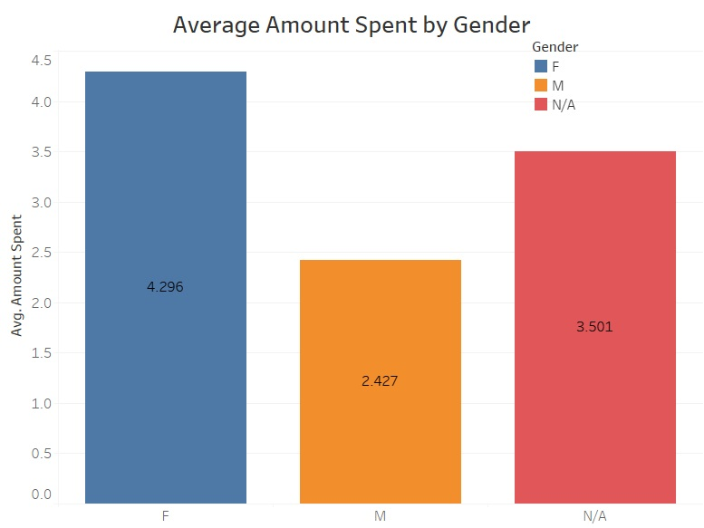
</p>
<p align = "center" width="100%">
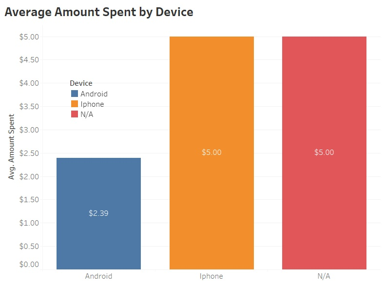
</p>

-	Gender
<p align = "center" width="100%">
  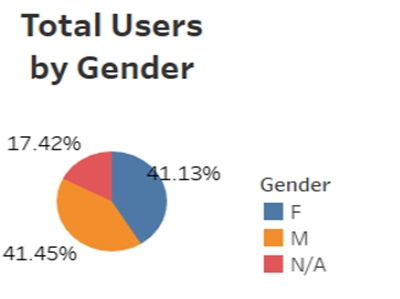
</p>

-	Device
<p align = "center" width="100%">
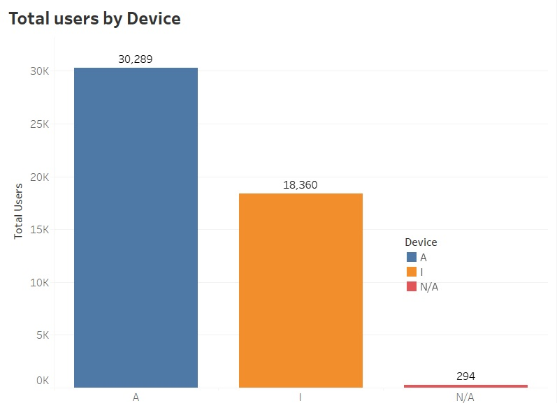
</p>

- Group
<p align = "center" width="100%">
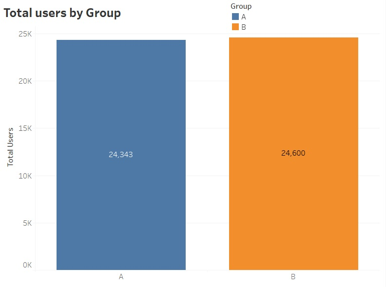
</p>

-	Converted Users
<p align = "center" width="100%">
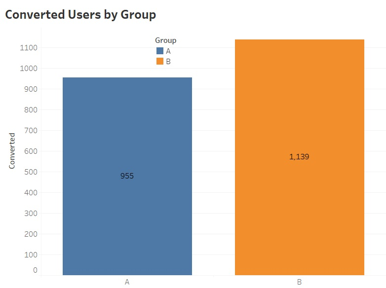
</p>

<p align = "center" width="100%">
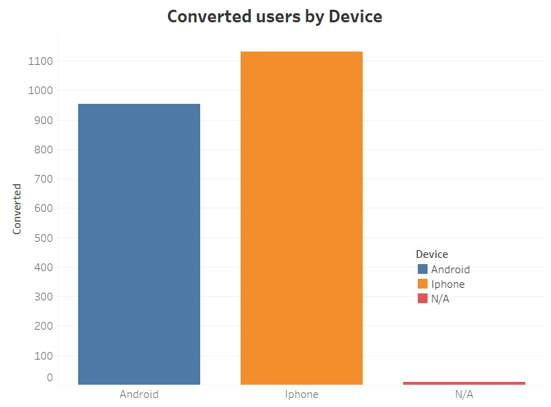
</p>

<p align = "center" width="100%">
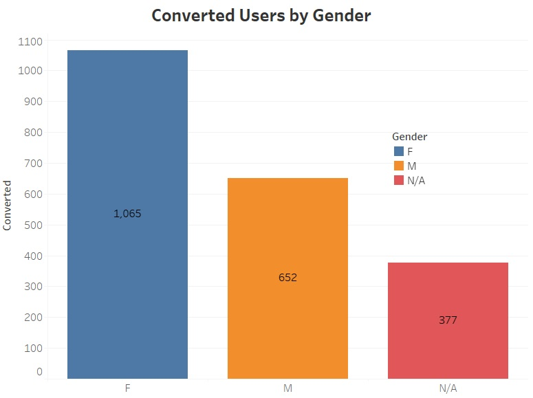
</p>


### Test parameters
To assess the potential impact of the new webpage design, I'll examine the following variables:

-	Conversion rate
If the user makes one or more purchases after joining the experiment, it would be considered as conversion. 

-	Amount Spent
Average amount spent by users from both group is considered to investigate whether new web design contributes to increase in revenue or not?
### Analysis
The hypothesis testing A/B and confidence interval calculation will be performed on both variables conversion rate and amount spent.

-  #### Conversion rate 

<p align = "center" width="100%">
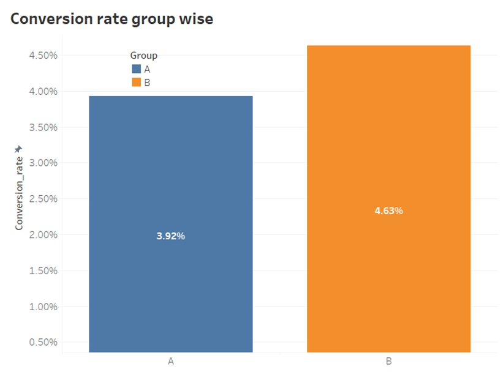
</p>
The above figure has shown that there is difference in conversion rate between both groups. The difference in bar lengths can be seen. Our analysis aims to determine whether this difference signifies a significant relationship between the new webpage design and Group B.


**Hypothesis Test**

Null hypothesis states that there is no difference in conversion rate between both groups. And alternative is that there is difference in conversion rate between both groups. The difference in conversion rate among control and treatment group is not zero.
  
  H<sub>0</sub>: p<sub>2</sub>-p<sub>1</sub>=p<sub>0</sub>  or p<sub>1</sub>= p<sub>2</sub>

  H<sub>1</sub> : p<sub>2</sub>-p<sub>1</sub><>p<sub>0</sub>

Where:

p<sub>1</sub> = conversion rate for control group A

p<sub>2</sub> = conversion rate for treatment group B

**Test details**

<ins> Two sample z test with pooled proportion (Two tail test) </ins>

Two sample z-test with pooled proportion is used because in Null hypothesis we consider difference in conversion rate to be zero. Hence, we have assumed that variance of two populations is same. The pooling is related to the estimation of standard error. In this pooling version of z-test both proportions are averaged and only one is used for calculation of standard error.

<p align = "center" width="100%">
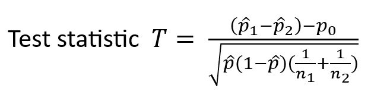
</p>

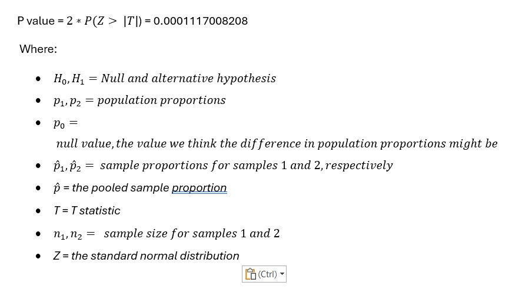

**Result**

The p value 0.0001 is less than 0.05, so if really no difference exits in conversion rate between two groups, we would see such an extreme result only less than 1% of the time. In other words, probability that we got this result by chance is less than 1 %. 

P- value describes a probability not, a certainty. We are confident that conversion rate for new web design is greater in treatment group. Therefore, we conclude that there is statistically significant difference between conversion rate for two groups. We reject the null hypothesis of no difference in conversion rate between two groups.

**95% Confidence Interval for difference in conversion rate between control and treatment groups**

<ins> Two sample z-interval with unpooled proportions </ins>

Confidence interval is used to create a best range in which we are pretty sure that the actual value lies in. It is the range of possible values of parameter (point estimate ± margin of error) with certain amount of confidence.  Margin of error considers the uncertainty in estimation because of using a sample to make inference about entire population. 
95% confidence interval entails that if we take 100 different samples and calculate confidence interval each time than 95 out of 100 confidence intervals will contain the true value of the parameter.

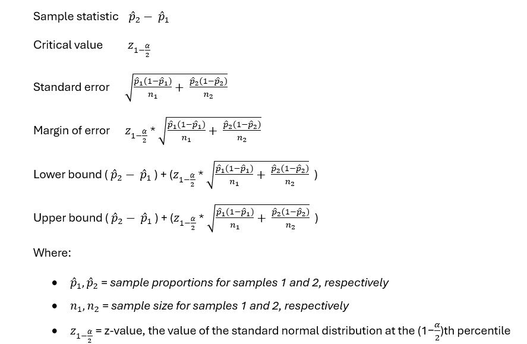

**Result**

95% confidence internal of difference in conversion rate between treatment and control group is (0.003486, 0.010654). The point estimate for difference in conversion rate between two groups is 0.0070698, and we are 95% confident that true value of difference is between 0.003486 and 0.010654. The null value for the difference in conversion rate is zero. Because the 95% confidence level doesn’t include zero, we conclude that difference in conversion rate between control and treatment group is significant.

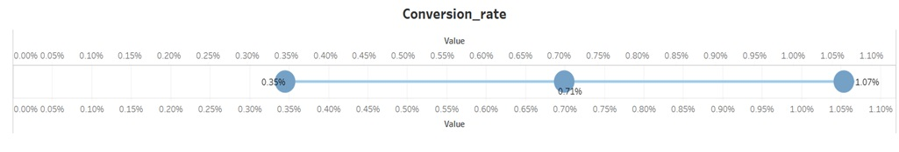

- #### Amount Spent
<p align = "center" width="100%">
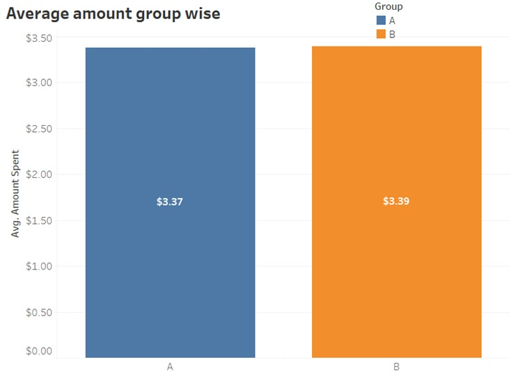
</p>

The depicted figure indicates a minimal variance in the average amount spent by both groups. We need to check if this difference is statistically significant.

<ins>Two sample t-test with unpooled variance</ins>

When it is not possible to make assumption of equal variances, we consider separate or unpooled variances. We still have following assumptions.
- The populations are independent.
- Each population is either normal or sample size is large.

The null hypothesis is that there is no difference in the average amount spent per user between two groups. While the alternate hypothesis is that there is a difference in average amount spent per user between control and treatment groups. 

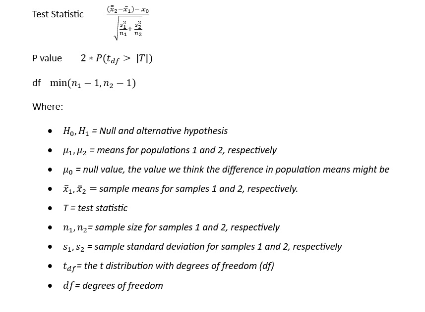

**Result**
The considered level of significance is 5%. Which means that there is 95% probability that results found in this experiment are the result of true difference between control and treatment groups. The p-value we got is 0.9438560437. The p-value is not less than 0.05. Hence, we conclude that the difference in average amount spent between two group wasn’t significantly different. We cannot reject null hypothesis.

**95% Confidence Interval for difference in the average amount spent per users between treatment and Control.**

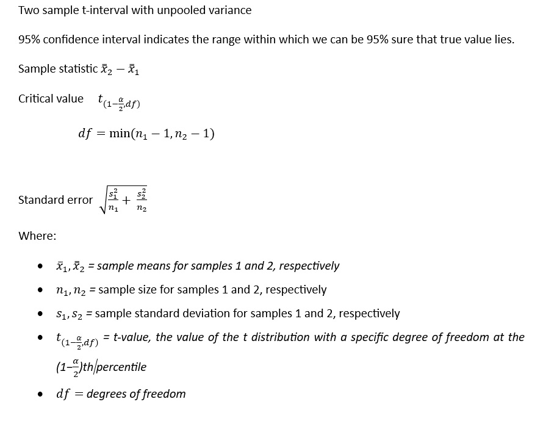

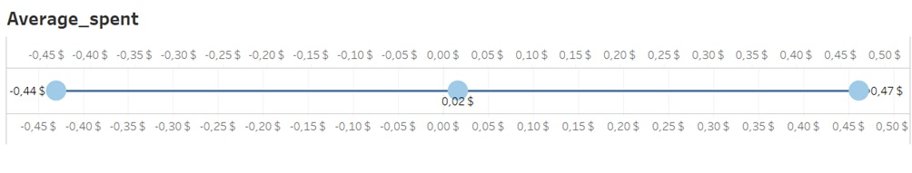


```javascript
if (isAwesome){
  return true
}
```

### 2. Assess assumptions on which statistical inference will be based

```javascript
if (isAwesome){
  return true
}
```

### 3. Support the selection of appropriate statistical tools and techniques


### 4. Provide a basis for further data collection through surveys or experiments

Sed ut perspiciatis unde omnis iste natus error sit voluptatem accusantium doloremque laudantium, totam rem aperiam, eaque ipsa quae ab illo inventore veritatis et quasi architecto beatae vitae dicta sunt explicabo. 

For more details see [GitHub Flavored Markdown](https://guides.github.com/features/mastering-markdown/).
