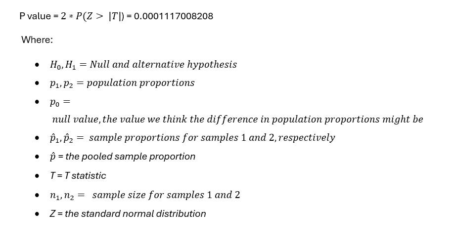

#  A/B Hypothesis Test Analysis

## Summmary 
This report aims to describe in detail the findings of A/B hypothesis test which was designed to compare the two versions of webpage. The new version of webpage has been created to increase awareness about newly introduced food and drink offerings. The objective of this action is to increase revenue. The test involves addition of banner of products in food and drink category at the top of website.
The way control and treatment group will see the webpage is shown below:

Users will be randomly assigned to both groups.  

### Data
To extract GloBox data, we made an SQL query and subsequently conducted analysis using Google Sheets and Tableau. The query and associated tasks in Google Sheets can be found appended to the conclusion of this document. We examined the following variables:
- User id
-	Country
-	Average amount spent
<p align = "center" width="100%">

</p>
<p align = "center" width="100%">

</p>

-	Gender
<p align = "center" width="100%">
  
</p>

-	Device
<p align = "center" width="100%">

</p>

- Group
<p align = "center" width="100%">

</p>

-	Converted Users
<p align = "center" width="100%">

</p>

<p align = "center" width="100%">

</p>

<p align = "center" width="100%">

</p>


### Test parameters
To assess the potential impact of the new webpage design, I'll examine the following variables:

-	Conversion rate
If the user makes one or more purchases after joining the experiment, it would be considered as conversion. 

-	Amount Spent
Average amount spent by users from both group is considered to investigate whether new web design contributes to increase in revenue or not?
### Analysis
The hypothesis testing A/B and confidence interval calculation will be performed on both variables conversion rate and amount spent. 

<p align = "center" width="100%">

</p>
The above figure has shown that there is difference in conversion rate between both groups. The difference in bar lengths can be seen. Our analysis aims to determine whether this difference signifies a significant relationship between the new webpage design and Group B.


**Hypothesis Test**

Null hypothesis states that there is no difference in conversion rate between both groups. And alternative is that there is difference in conversion rate between both groups. The difference in conversion rate among control and treatment group is not zero.
  
  H<sub>0</sub>: p<sub>2</sub>-p<sub>1</sub>=p<sub>0</sub>  or p<sub>1</sub>= p<sub>2</sub>

  H<sub>1</sub> : p<sub>2</sub>-p<sub>1</sub><>p<sub>0</sub>

Where:

p<sub>1</sub> = conversion rate for control group A

p<sub>2</sub> = conversion rate for treatment group B

**Test details**

<ins> Two sample z test with pooled proportion (Two tail test) </ins>

Two sample z-test with pooled proportion is used because in Null hypothesis we consider difference in conversion rate to be zero. Hence, we have assumed that variance of two populations is same. The pooling is related to the estimation of standard error. In this pooling version of z-test both proportions are averaged and only one is used for calculation of standard error.

<p align = "center" width="100%">

</p>




```javascript
if (isAwesome){
  return true
}
```

### 2. Assess assumptions on which statistical inference will be based

```javascript
if (isAwesome){
  return true
}
```

### 3. Support the selection of appropriate statistical tools and techniques


### 4. Provide a basis for further data collection through surveys or experiments

Sed ut perspiciatis unde omnis iste natus error sit voluptatem accusantium doloremque laudantium, totam rem aperiam, eaque ipsa quae ab illo inventore veritatis et quasi architecto beatae vitae dicta sunt explicabo. 

For more details see [GitHub Flavored Markdown](https://guides.github.com/features/mastering-markdown/).
